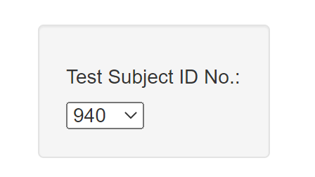
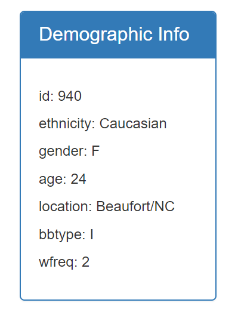
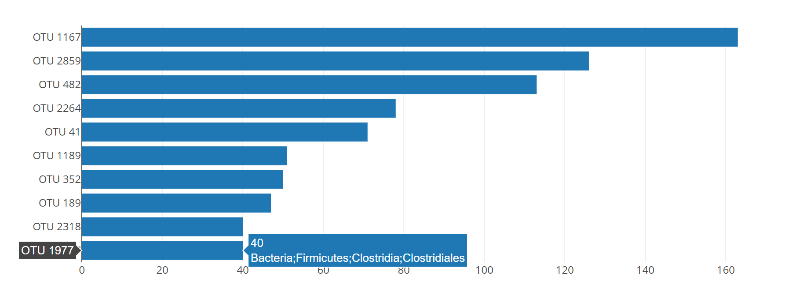
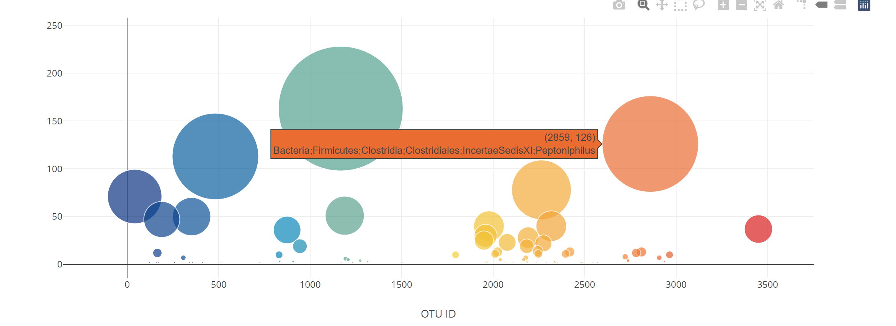

# Ploty_Challenge_BioDiversity

The dataset reveals that a small handful of microbial species (also called operational taxonomic units, or OTUs, in the study) were present in more than 70% of people, while the rest were relatively rare.

In this assignment, I built an interactive dashboard to explore a dataset for Belly Button Biodiversity which catalogs the microbes that colonize human navels.

Steps for Interactive Dashboard: 

1) Create a Selectable Drop down inorder to chose the subject number for addtional details:

2) Create a Snapshot of the MetaData for the selected Test Subject: 

3) Below highlights the two interactive charts along with the markers included in the dashboard:

- Horizontal Bar Chart:

- Bubble Chart

### Resources:
- Figure Labels: https://plotly.com/python/figure-labels/
- Colorscales:  https://plotly.com/javascript/colorscales/
- Bar Charts: https://plotly.com/javascript/bar-charts/
- Bubble Charts: https://plotly.com/javascript/bubble-charts/
- Additional Configs: https://plotly.com/javascript/configuration-options/

